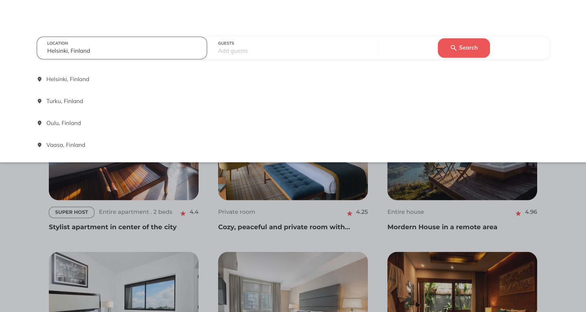
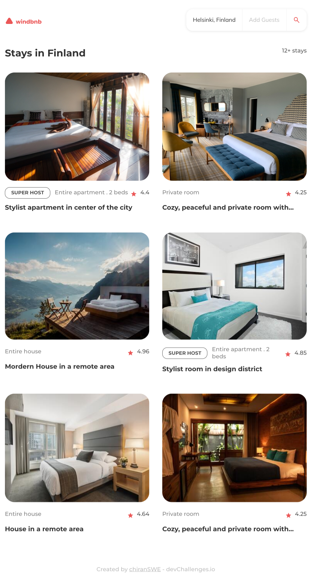
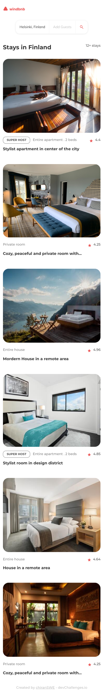
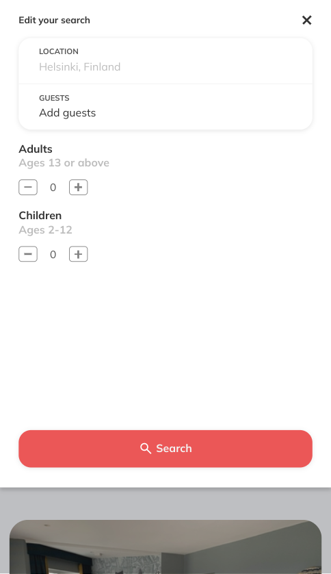
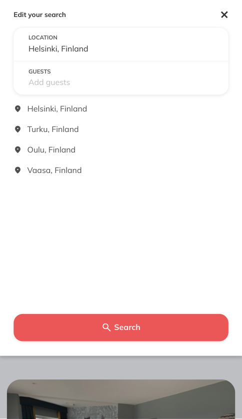

<!-- Please update value in the {}  -->

<h1 align="center">Tonmoy Chiran Portfolio</h1>

   Solution for a challenge from  <a href="https://devchallenges.io/" target="_blank">Devchallenges.io</a>.

  <h3>
    <a href="https://portfolio-dev-challenges.vercel.app/">
      Demo
    </a>
     | 
    <a href="https://github.com/TheChiran/windbnb-dev-challenges">
      Solution
    </a>
     | 
    <a href="https://devchallenges.io/challenges/5ZnOYsSXM24JWnCsNFlt">
      Challenge
    </a>
  </h3>

<!-- TABLE OF CONTENTS -->

## Table of Contents

- [Overview](#overview)
  - [Built With](#built-with)
- [Features](#features)
- [Contact](#contact)
- [Acknowledgements](#acknowledgements)

<!-- OVERVIEW -->

## Overview
### This challenge was very special one for me, I thought of why not make it my own portfolio. So, I did  my best to make it look great. To make it interactive I added some extra features including

- Layout change
- Theme change (light / dark)

To make it happen, I used some useful libraries which must be mentioned

- Framer motion (For animation)
- React typed (For animated writing like name)
- rsuitejs 

I have named it as version 1, as I am planning on making some more features to add.
#

<!-- ### Default layout

#### Light version (Desktop view)

### Tablet View

### Mobile View

 -->

### Built With

<!-- This section should list any major frameworks that you built your project using. Here are a few examples.-->

- [HTML](https://html.com/)
- [CSS](https://developer.mozilla.org/en-US/docs/Web/CSS)
- [SCSS](https://sass-lang.com/)
- [SCSS](https://reactjs.org/)
- [Type Script](https://www.typescriptlang.org/)
- [Vite](https://vitejs.dev/)
- [rsuitejs](https://rsuitejs.com/guide/introduction/)
- [Framer Motion](https://www.framer.com/motion/)
- [react-typed](http://ssbeefeater.github.io/react-typed)

## Features

<!-- List the features of your application or follow the template. Don't share the figma file here :) -->

- Responsive
- Mobile First
- Component Based
- UI Design
- Animated component
- Theme based (light / dark)
- Multiple Layout 

## Acknowledgements

<!-- This section should list any articles or add-ons/plugins that helps you to complete the project. This is optional but it will help you in the future. For exmpale -->

- [Steps to replicate a design with only HTML and CSS](https://devchallenges-blogs.web.app/how-to-replicate-design/)
- [Node.js](https://nodejs.org/)
- [Marked - a markdown parser](https://github.com/chjj/marked)

## Contact

- Website [http://chirantonmoy.vercel.app/](http://chirantonmoy.vercel.app/})
- GitHub [@theChiran](https://github.com/TheChiran)
- LinkedIn [@tonmoy-chiran](https://www.linkedin.com/in/tonmoy-chiran-0920b2151/})
